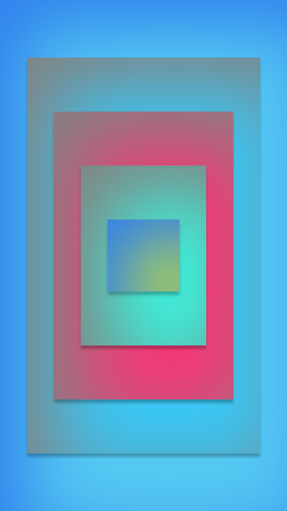
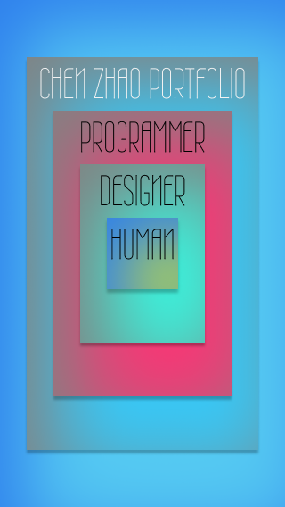
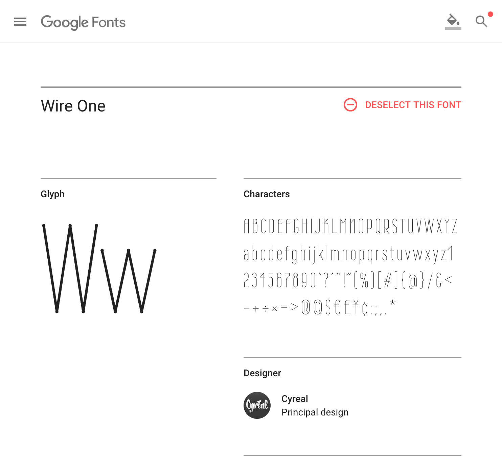
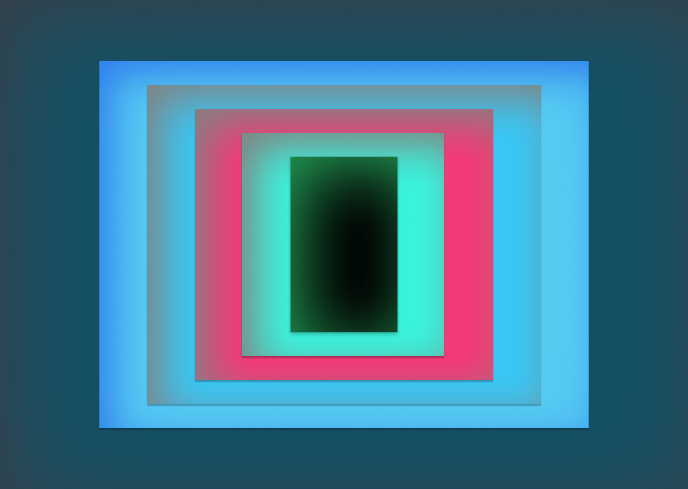
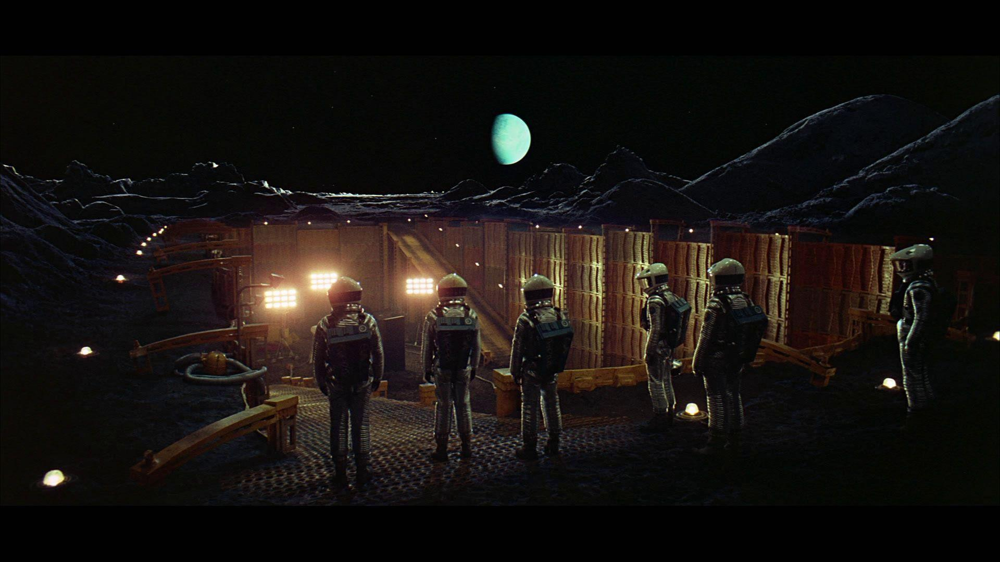
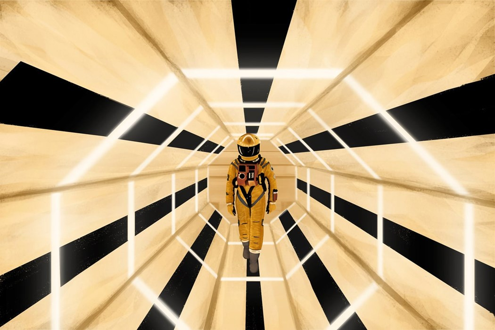
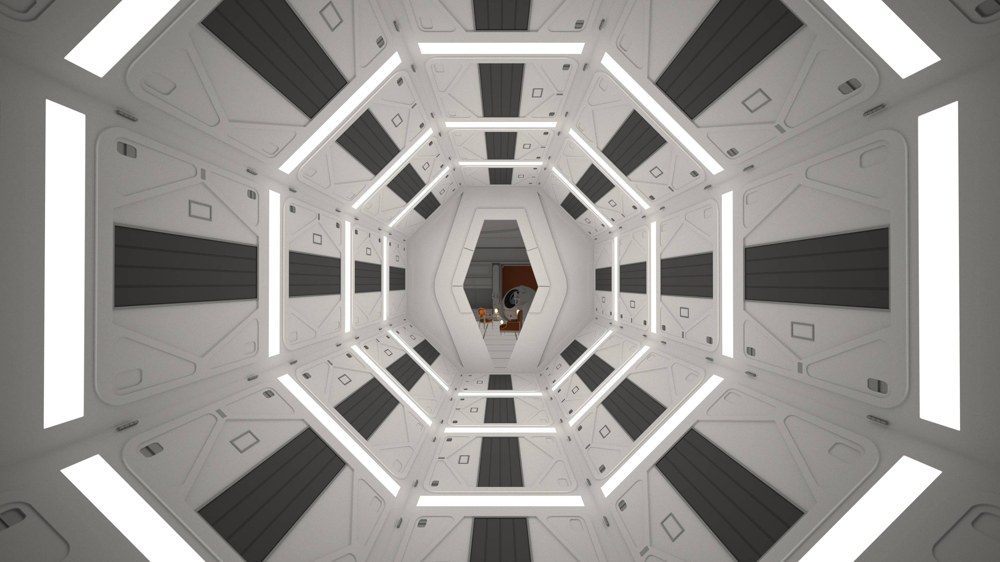

# Chen's Portfolio Website
self-explanatory

# TODO
- [ ] update content
- [ ] replace whole project with react
- [ ] improve seo
- [ ] hosted in own domain n server

# Aim
Simple. Simple. Simple
- Too many websites homogeneous, espcially portfolio websites
- Suit my personalities, down to business with unique daring aesthetic
- Simplicity has became a trendy and cheap commodity, losing it's soul
- Anti/Break rules
- Organic, minimise decoration images
- Magic, browsing it should not feel like browing website
- Zen, it can be left open in the screen as an art
- Loosen imagination 
- Every elements serves for funtionality purpose

# My inspiration comes from:
- Ceiling above me
- Truth is: I wasn't really turned on about the idea of design, and at the beginning of this project, My feeling was wasting time. So I decided if I'm going to do this, I will only do it to not follow the rules and common trend.

# Design Stage One: Imagine
- Plan structures and form factors in mobile viewport
- Mobile first thinking
- Thinking about operation flow on mobile viewport

# Design Stage Two: Mobile Design

This is the starting point of the protfolio project:

Only structure and initial color combination, took about no more than 10 minutes to create in Figma, but lead to one whole week's dedication and one literally sleepless weekend, btw, by now, it is about on the mark of 48 hours, still holding up pretty good.

Second is the same design with matching font:

Notice: names for each section's name is not the same as the final web, but they are important, as this structure of inner to outer(from a human (later changed to soul) to an individual's archievement showcase website).

Nothing fancy, randomly chose a font from 'Google Fonts' within seconds, and really happy with it, "Wire One", really not the most pleasant font to read, which can be used for title or short reading.

Here is what the "Wire One" font in a glimpse:

Obeviously it's too slim, not really useful for many situations, but fit into the this portfolio's non-main stream dreamy color scheme and very symmetrical and artificial form factor, Which is good plus, later Ruegen enlighten me with quite eye opening knowledge, that this font is actually belong to once glorious but short lived Art Deco design genre, in fact the whole initail design itself reminisce Art Deco unintentionally, always learn from others and always discovery within.

# Design Stage Three: Larger Viewport

No special arrangement need to apply the design to computer, Squares are very portable to all different shapes and sizes, beauty of fundamental geometric shapes, they exist everywhere and suitable for all occasions, only limitation is imagination.

Even though now, mobile devices are the most significant digital interfaces, but there are many characters larger viewport provided can not be replaced by a palm size screen, I truely believe mobile is the first class citizen now, desktop viewport can make some real art pieces. No Junks.

This is the initial design for large viewport:

As you can see, the colors are majorly unchanged from phone view, but with one extra section on top, I wanted to ultilise the extra view real estate, but eventually did not apply it to my current portfolio design, simply due to I don't have enough subsection for portfolio.

about the center dark rectangle shape, it definitely was a interesting choice, I believe the inspiration was subconciously from one of the best motion pictures "2001: A Space Odyssey", the infamous "Black Stone":

For now, the structure and form factors of this portfolio design was about to settle, but, HERE COMES THE QUESTIONS: HOW TO RELATE THIS TO A PORTFOLIO WEBSITE? Which costed me lots of thinking to make it happen, still not the most satisfying result to myself.

Here comes the hidden Figma link:
https://www.figma.com/file/IKOhpcs0WpI8o0XFfMYUAoz2/Untitled
https://www.figma.com/file/Whu6nrnZfMAapAP4hyGPT7mH/Untitled
# Design Stage Four: Design and Function meet each others, THE CHAOS.

